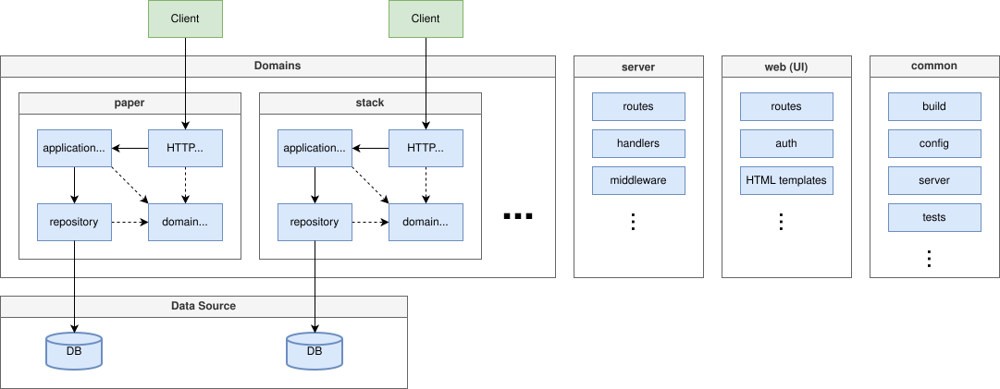

# Paperstacks Backend

Backend for the Paperstacks application, written in Go.

## Architecture Overview



## Prerequisites

- Go 1.26 or later

Install dependencies:

```bash
make deps
```

## Building

To build the server binary:

```bash
make build
```

This will compile the application and create a `server` executable in the current directory.

To clean up build artifacts:

```bash
make clean
```

## Running

Start the server with:

```bash
./server
```

The server will start on `localhost:8080` by default.

### Configuration

You can customize the server behavior with environment variables:

- `HOST` - Server host (default: `localhost`)
- `PORT` - Server port (default: `8080`)

Example:

```bash
HOST=0.0.0.0 PORT=9000 ./server
```

## Testing

Run all unit tests:

```bash
make test
```

Run integration tests:

```bash
make test-integration
```

Test coverage is generated in `coverage.out`.

## Development

Run the server with live reload:

```bash
air
```

If you make modifications on the HTMX/CSS part also run:

```bash
npm run watch:css
```

## Versioning

This project follows [Semantic Versioning](https://semver.org/) and uses Git tags prefixed with v (for example, v1.2.3).

When preparing a new release:

1. Determine the next version according to Semantic Versioning:

   - **PATCH** (`v1.2.3` → `v1.2.4`): Bug fixes and other backward-compatible changes.
   - **MINOR** (`v1.2.3` → `v1.3.0`): New backward-compatible features.
   - **MAJOR** (`v1.2.3` → `v2.0.0`): Breaking changes.

2. Create an annotated Git tag for the release and push the tag:

 ```bash
   git tag -a v1.2.3 -m "Release v1.2.3"
   git push origin v1.2.3
   ```

## HTTP API

`openapi.yaml` contains a API documentation that can be viewed with
[Swagger Editor](https://editor.swagger.io/?url=https://raw.githubusercontent.com/paperstacks-io/paperstacks/main/backend/openapi.yaml)
or [Redoc](https://redocly.github.io/redoc/?url=https://raw.githubusercontent.com/paperstacks-io/paperstacks/main/backend/openapi.yaml).
